Final project badges

# Develop Build status

| ID | Requirement                                                                                | Met | Screenshot                    |
|----|--------------------------------------------------------------------------------------------|-----|-------------------------------|
| 1  | All the countries in the world organised by largest population to smallest                 | Yes | 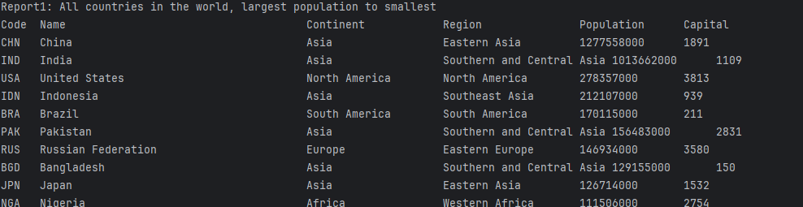  |
| 2  | All the countries in a continent organised by largest population to smallest               | Yes | 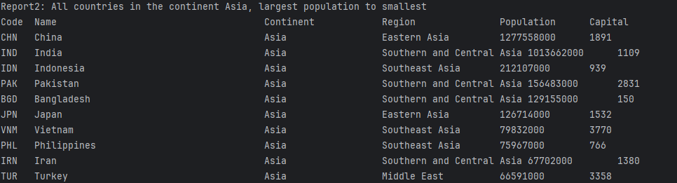  |
| 3  | All the countries in a region organised by largest population to smallest                  | Yes | 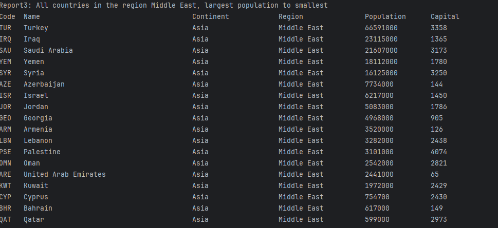  |
| 4  | Top N populated countries in the world where N is provided by the user                     | Yes | 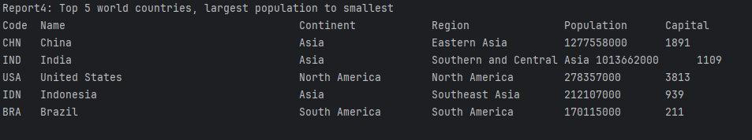  |
| 5  | Top N populated countries in a continent where N is provided by the user                   | Yes | 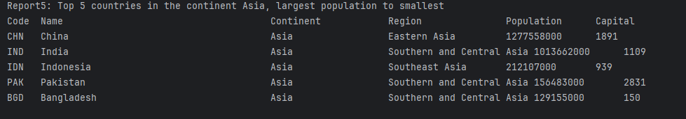  |
| 6  | Top N populated countries in a region where N is provided by the user                      | Yes | 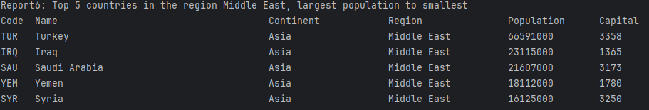  |
| 7  | All the cities in the world organised by largest population to smallest                    | Yes | 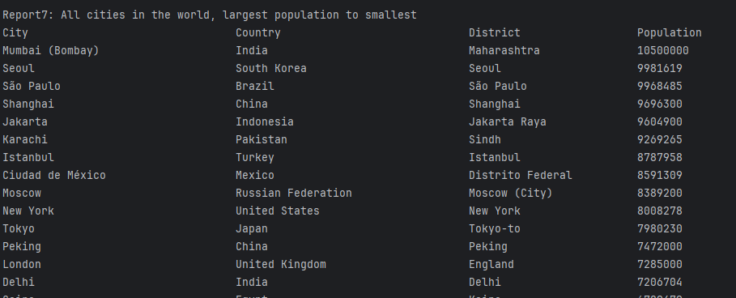  |
| 8  | All the cities in a continent organised by largest population to smallest                  | Yes | 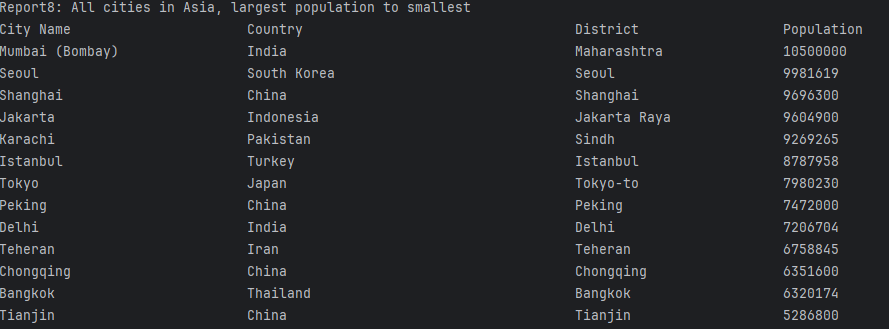  |
| 9  | All the cities in a region organised by largest population to smallest                     | Yes | 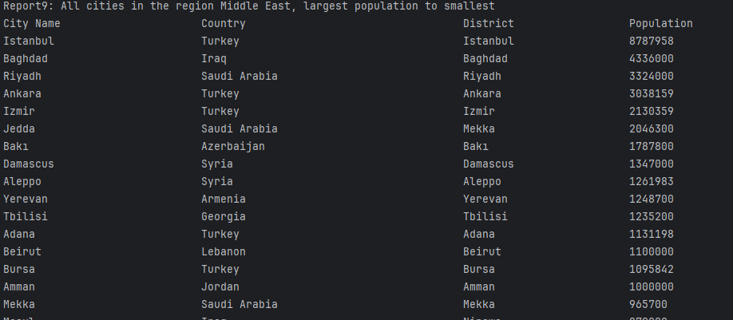  |
| 10 | All the cities in a country organised by largest population to smallest                    | Yes | 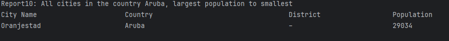 |
| 11 | All the cities in a district organised by largest population to smallest                   | Yes | 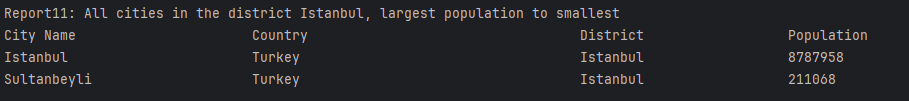 |
| 12 | Top N populated cities in the world where N is provided by the user                        | Yes | 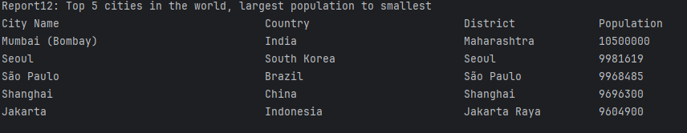 |
| 13 | Top N populated cities in a continent where N is provided by the user                      | Yes | 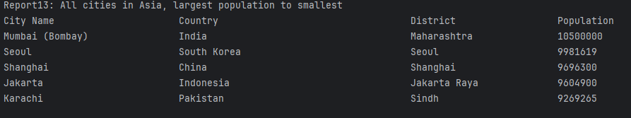 |
| 14 | Top N populated cities in a region where N is provided by the user                         | Yes | 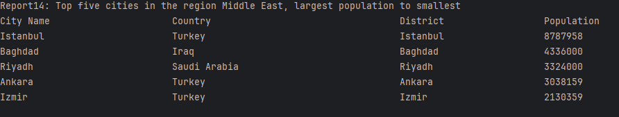 |
| 15 | Top N populated cities in a country where N is provided by the user                        | Yes | 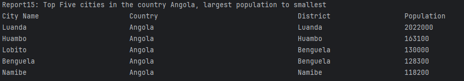 |
| 16 | Top N populated cities in a district where N is provided by the user                       | Yes | 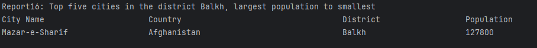 |
| 17 | All the capital cities in the world organised by largest population to smallest            | Yes | 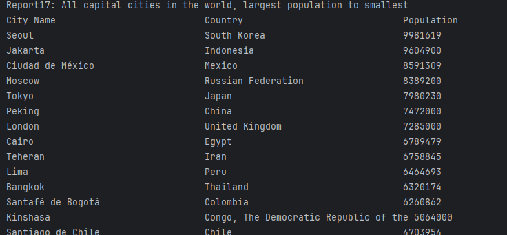 |
| 18 | All the capital cities in a continent organised by largest population to smallest          | Yes | 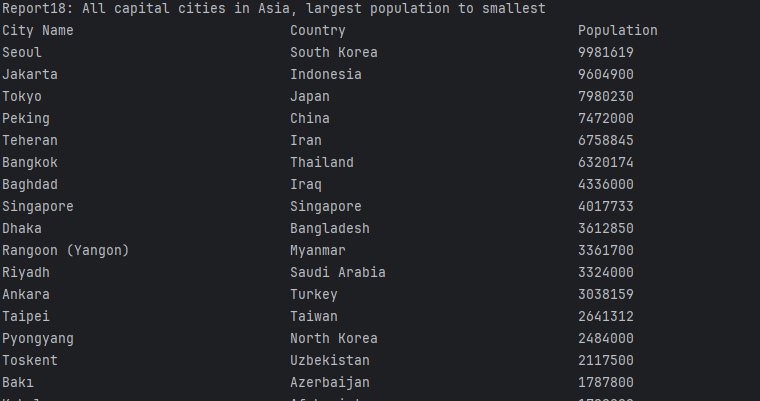 |
| 19 | All the capital cities in a region organised by largest population to smallest             | Yes | 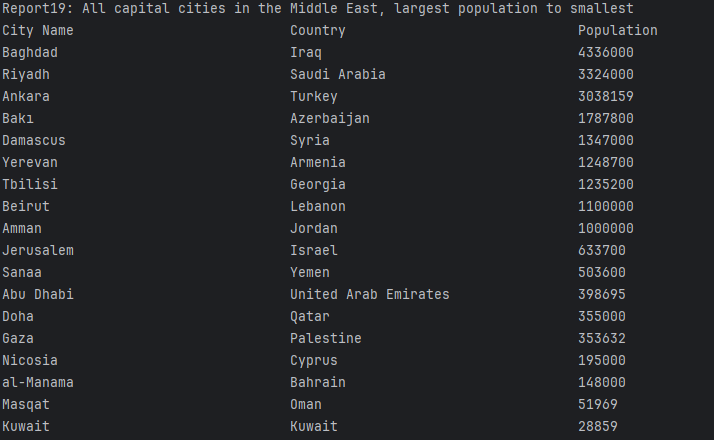 |
| 20 | Top N populated capital cities in the world where N is provided by the user                | Yes | 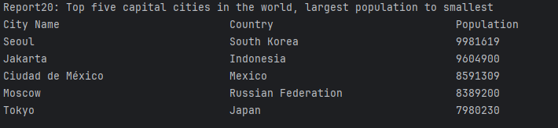 |
| 21 | Top N populated capital cities in a continent where N is provided by the user              | Yes | 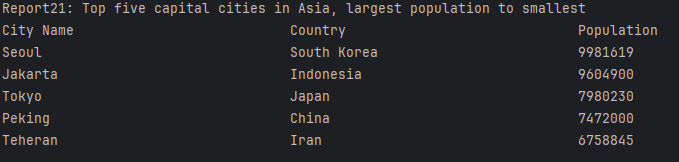 |
| 22 | Top N populated capital cities in a region where N is provided by the user                 | Yes | 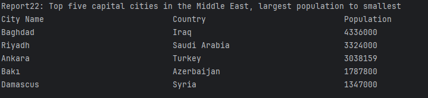 |
| 23 | Population of people, people living in cities, and not living in cities in each continent  | Yes | 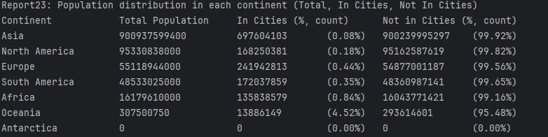 |
| 24 | Population of people, people living in cities, and not living in cities in each region     | Yes | 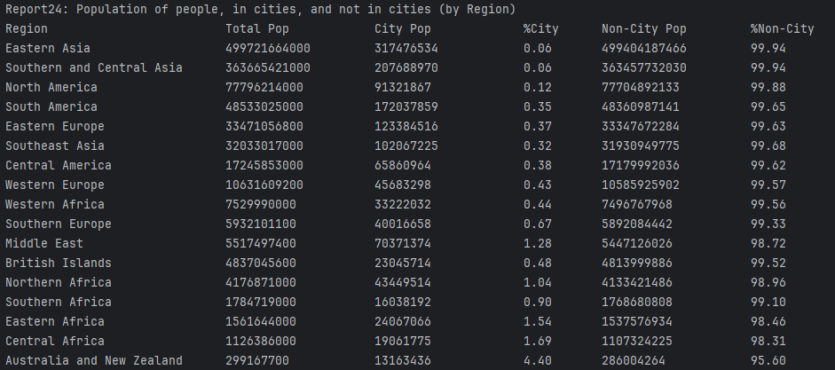 |
| 25 | Population of people, people living in cities, and not living in cities in each country    | Yes | 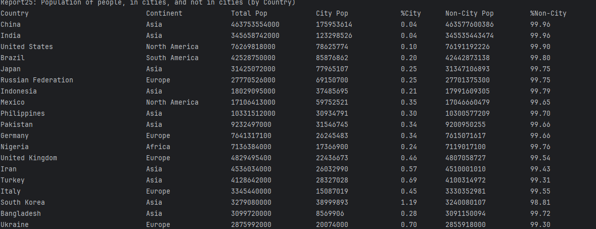 |
| 26 | Population of the world                                                                    | Yes | 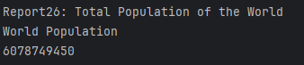 |
| 27 | Population of a continent                                                                  | Yes | 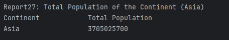 |
| 28 | Population of a region                                                                     | Yes | 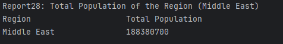 |
| 29 | Population of a country                                                                    | Yes | 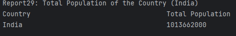 |
| 30 | Population of a district                                                                   | Yes | 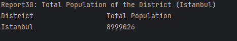 |
| 31 | Population of a city                                                                       | Yes | 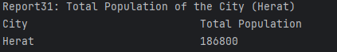 |
| 32 | Number and percentage of people who speak Chinese, including the % of the world population | Yes | 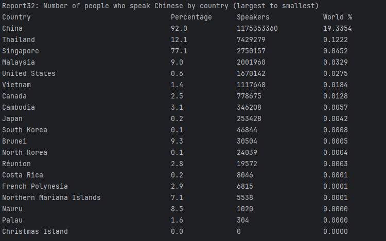 |
| 33 | Number and percentage of people who speak English, including the % of the world population | Yes | 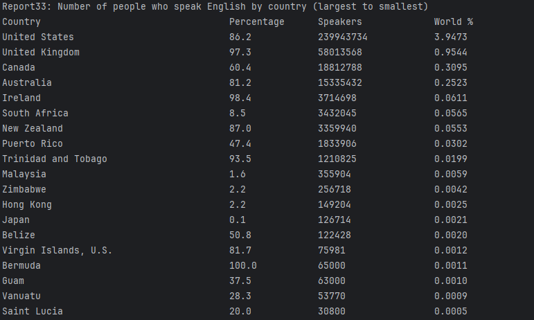 |
| 34 | Number and percentage of people who speak Hindi, including the % of the world population   | Yes | 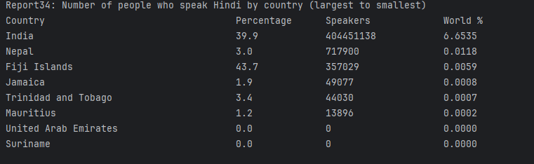 |
| 35 | Number and percentage of people who speak Spanish, including the % of the world population | Yes | 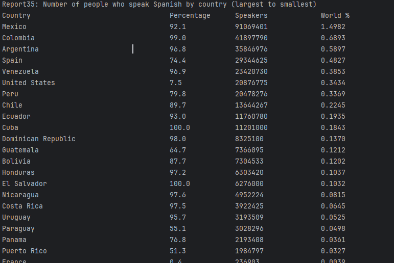 |
| 36 | Number and percentage of people who speak Arabic, including the % of the world population  | Yes | 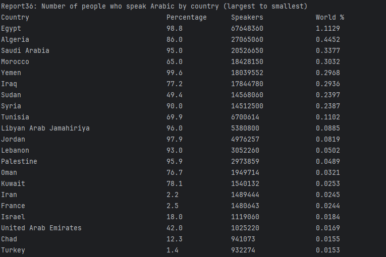 |

32 requirements of 32 have been implemented, which is 100%.